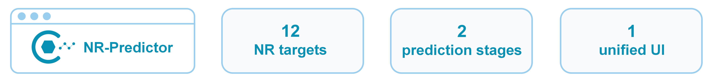
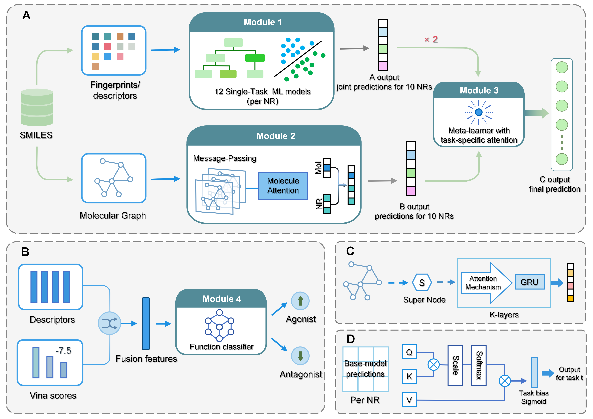

# NR-Predictor

NR-Predictor: A Hierarchical Framework for Predicting Ligand Binding and Functional Activity of Nuclear Receptors

<p align="center">
  
</p>

The web server can be used directly at: https://lmmd.ecust.edu.cn/nrpre/

## Framework

<p align="center">
  
</p>

## Environment Setup

The recommended environment uses Python 3.10.

```bash
conda create -n nrpre python=3.10
conda activate nrpre

pip install torch==2.0.1 --index-url https://download.pytorch.org/whl/cu118
pip install torch-geometric==2.6.1
pip install scikit-learn
pip install texttable
conda install -c conda-forge rdkit=2024.3.6
pip install numpy==1.24.4

curl -L -o dgl-1.1.2+cu118-cp310-cp310-manylinux1_x86_64.whl https://data.dgl.ai/wheels/cu118/dgl-1.1.2%2Bcu118-cp310-cp310-manylinux1_x86_64.whl
pip install dgl-1.1.2+cu118-cp310-cp310-manylinux1_x86_64.whl
pip install dgllife

conda install -c conda-forge meeko=0.6.1
pip install xgboost
```

The DGL wheel above is for Linux, Python 3.10, CUDA 11.8. If your CUDA, Python, or operating system differs, install the matching PyTorch/DGL builds.

## Repository Structure

```text
NR-Predictor/
|-- NR-2025/
|-- NR_binder/
|-- NR_ago&ant/
`-- Picture/
```

## NR-2025

`NR-2025` contains the curated nuclear receptor datasets and data-processing resources used in this project.

Main contents:

- Processed qualitative datasets at 10 uM and 100 uM thresholds.
- Multi-task quantitative dataset.
- External validation dataset primarily collected from JMC literature.
- KNIME processing pipelines used for data cleaning and merging.

## NR_binder

`NR_binder` contains the ligand-binding prediction workflow.

### Reproducing Training

Run the scripts in this order:

```bash
cd NR_binder

python ml_train.py
python gnn_train.py
python ensemble_attention_stacking.py
```

Workflow:

1. `ml_train.py` trains machine-learning base models using molecular fingerprints/descriptors.
2. `gnn_train.py` trains multi-task GNN models for ligand-binding prediction.
3. `ensemble_attention_stacking.py` trains the attention-based stacking model using the base model predictions.

### Local Prediction

After the trained model files are available, run:

```bash
cd NR_binder
python predict_binder.py
```

For most users, ligand-binding prediction can also be performed directly through the web server.

## NR_ago&ant

`NR_ago&ant` contains the functional activity prediction workflow for agonist/antagonist classification.

### Reproducing Training

Run the scripts in this order:

```bash
cd "NR_ago&ant"

python vina/prepare_ligand.py --smiles_file <task_smiles.txt> --output vina/ligands/<TASK>
python feature.py
python build_models.py
```

Workflow:

1. `vina/prepare_ligand.py` generates ligand PDBQT files from SMILES for the training data.
2. `feature.py` generates descriptor and Vina docking score feature files.
3. `build_models.py` trains the functional activity models from the generated feature files.

### Local Prediction

After the model files are available, run:

```bash
cd "NR_ago&ant"
python predict.py
```

## Notes

- The online server is the recommended entry point for direct prediction.
- Local reproduction requires the trained model files and the processed datasets to be kept in the expected folder structure.
- Vina-based functional activity prediction requires receptor PDBQT files, Vina configuration files, and ligand PDBQT preparation.
